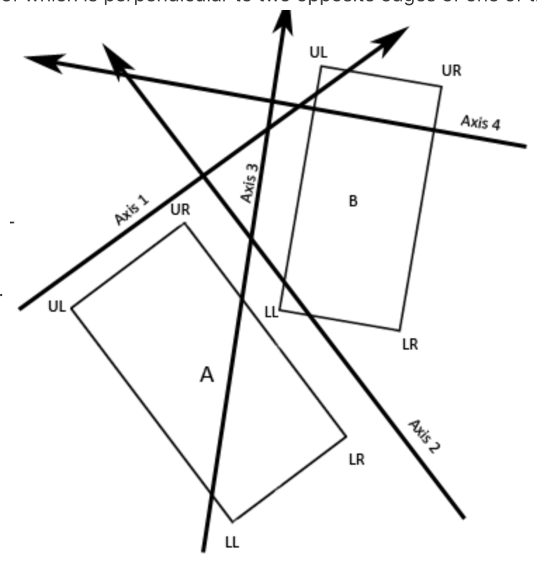
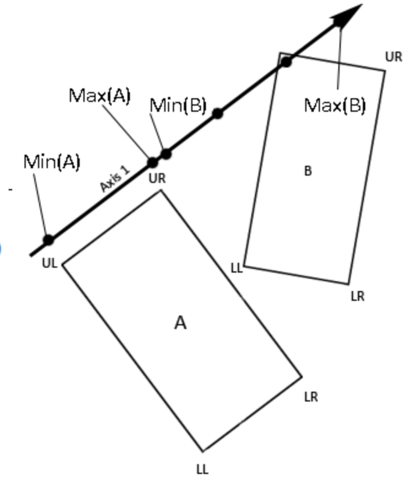

# Drift Car Simulator
[Live Demo](https://joseph-kung.github.io/drift-car-simulator/.)
### Background and Overview
  Drift Car Simulator is a top down driving game. The objective of the game is to drift as fast as possible while avoiding the obstacles on the abandoned airfield. You score points as you drift and you have a minute to rack up as many points as possible.
  
### Technologies Used
- Vanilla Javascript
- Canvas

### Features
**Driving Physics** 
The driving physics create a realistic driving experience for a 2D simulator. Acceleration is applied to the car in the direction it is facing, increasing the velocity in that direction. Friction adds another depth of realism as the car will slow down to a stop once the accelerator is released. Turning the car while accelerating will cause the car to drift and points will accumulate as speed and turning requirements are met. 

<br>

<br>
<br>

**Collision Detection**
Collision detection was a challenge due to the rotation of the car. A quick overview about this mechanic, in order to tackle this problem, I had to implement the Separating Axis Theorem. This involved keeping track of the corners of all objects including the rotating car. 
<br>
<br>

<br>
<br>

``` js
  turnCorners(corner) {
    let tempX = corner.x - this.x
    let tempY = corner.y - this.y

    let rotatedX = tempX * Math.cos(this.radDiff / 2) - tempY * Math.sin(this.radDiff / 2);
    let rotatedY = tempX * Math.sin(this.radDiff / 2) + tempY * Math.cos(this.radDiff / 2);


    
    return Object.assign(corner, {x: rotatedX + this.x, y: rotatedY + this.y})
  }
```
<br>
Using matrix rotation, I was able to calculate the new corners of the car after a rotation. 
With the corners of the objects, The coordinates are projected on to four perpendicular axes.
<br>
<br>


We want to then project all corners of the two objects onto each axis. If we see that the minimum value of one object is less than or equal to the maximum value of another object, and vice versa on all four axes, we know that the two objects are colliding.


<br>
<br>

``` js
const checkScalarForColision = (scalar1, scalar2) => {
  const min1 = Math.min(...scalar1);
  const max1 = Math.max(...scalar1);

  const min2 = Math.min(...scalar2);
  const max2 = Math.max(...scalar2);

  if (min2 <= max1 && min1 <= max2) {
    return true;
  }
  return false;
};

const isCollided = (rect1, rect2) => {
  const axis1 = {
    x: rect1.corners[1].x - rect1.corners[0].x,
    y: rect1.corners[1].y - rect1.corners[0].y,
  };
  const axis2 = {
    x: rect1.corners[1].x - rect1.corners[3].x,
    y: rect1.corners[1].y - rect1.corners[3].y,
  };
  const axis3 = {
    x: rect2.corners[0].x - rect2.corners[2].x,
    y: rect2.corners[0].y - rect2.corners[2].y,
  };
  const axis4 = {
    x: rect2.corners[0].x - rect2.corners[1].x,
    y: rect2.corners[0].y - rect2.corners[1].y,
  };

  const corners1 = [rect1.corners[1], rect1.corners[0], rect1.corners[3], rect1.corners[2]];
  const corners2 = [rect2.corners[1], rect2.corners[0], rect2.corners[3], rect2.corners[2]];

  const axes = [axis1, axis2, axis3, axis4];

  for (let i = 0; i < axes.length; i += 1) {
    const corners1ToAxis = corners1.map(corner => projectCornerToAxis(corner, axes[i]));
    const corners2ToAxis = corners2.map(corner => projectCornerToAxis(corner, axes[i]));

    const scalar1 = scalarValues(corners1ToAxis, axes[i]);
    const scalar2 = scalarValues(corners2ToAxis, axes[i]);

    if (checkScalarForColision(scalar1, scalar2) === false) {
      return false;
    }
  }
  return true;
};
```
For more information about Separating Axis Theorem click [here](https://www.gamedev.net/articles/programming/general-and-gameplay-programming/2d-rotated-rectangle-collision-r2604)
